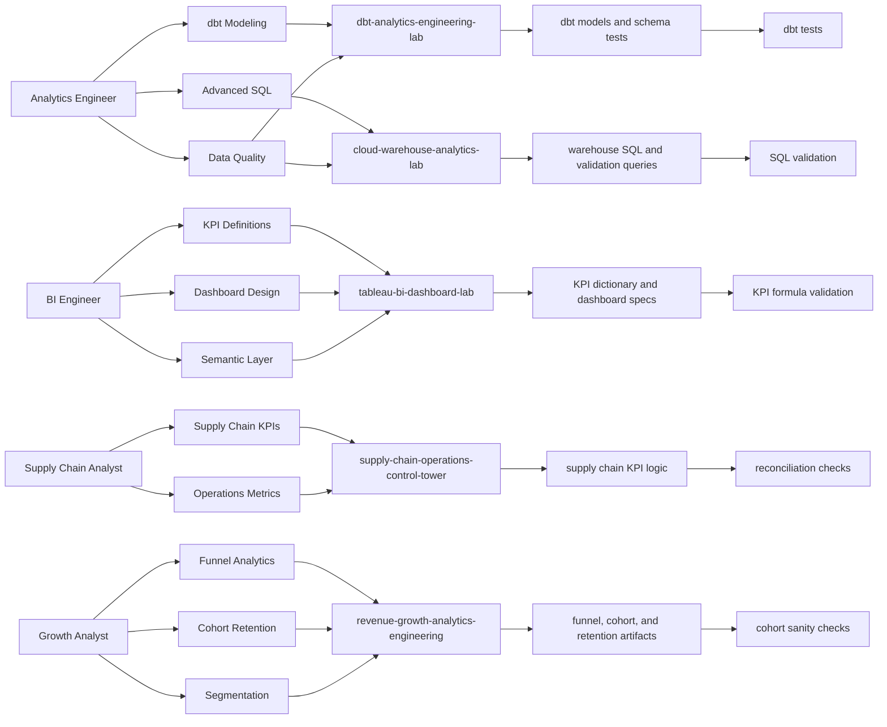

# Evidence Graph

## Purpose

This document defines the portfolio as a graph of evidence.

The portfolio should not depend on vague claims such as:

> I know SQL, Python, dbt, Tableau, supply chain analytics, and revenue analytics.

Instead, each claim should map to concrete proof:

```text
Skill -> Repository -> Artifact -> Validation -> Target Role -> Claim Level
```

This structure helps:

- recruiters scan the portfolio quickly
- hiring managers inspect technical credibility
- AI hiring systems extract evidence accurately
- Codex and ChatGPT improve repos without drifting into random changes

---

## Evidence Graph Model

### Nodes

The evidence graph has these node types:

| Node Type | Description |
|---|---|
| Role | Target job family |
| Skill | Capability being demonstrated |
| Repository | GitHub repo containing evidence |
| Artifact | Specific file, model, script, doc, query, or output |
| Validation | Test, check, review method, or expected output |
| Claim Level | Strength and boundary of the claim |
| Backlog Item | Improvement needed to strengthen evidence |

### Edges

The graph uses these relationships:

| Relationship | Meaning |
|---|---|
| Role requires Skill | A target role values this skill |
| Skill demonstrated by Repository | A repo contains relevant evidence |
| Repository contains Artifact | A repo includes a specific proof file |
| Artifact validated by Validation | The artifact has a check or review method |
| Artifact supports Claim Level | The artifact defines how strongly the skill can be claimed |
| Backlog Item improves Skill | A planned task strengthens a skill signal |

---

## Claim Levels

Use these claim levels consistently.

| Claim Level | Meaning |
|---|---|
| `Strong evidence` | Technical artifact, documentation, validation, and clear review path exist |
| `Lab evidence` | Realistic lab or simulation demonstrates the skill |
| `Pattern evidence` | Transferable design or implementation pattern exists |
| `Planned evidence` | The skill is planned but not yet proven |
| `Weak evidence` | Mention exists but proof is incomplete |

Avoid promoting weak or planned evidence as strong evidence.

---

## Target Roles

Primary target roles:

```text
Analytics Engineer
Data & Analytics Engineer
BI Analyst
BI Engineer
Data Analyst
Senior Data Analyst
Supply Chain Analyst
Operations Analyst
Revenue Analyst
Growth Analyst
Product Analyst
Analytics Consultant
AI-Augmented Data Workflow Specialist
```

---

## Role-to-Skill Graph

| Target Role | Skills Required | Strongest Evidence Repositories |
|---|---|---|
| Analytics Engineer | SQL, dbt, data modeling, tests, marts, lineage | `dbt-analytics-engineering-lab`, `cloud-warehouse-analytics-lab` |
| Data & Analytics Engineer | SQL, Python, warehouse modeling, orchestration, validation | `cloud-warehouse-analytics-lab`, `orchestration-data-pipelines-lab` |
| BI Engineer | KPI definitions, dashboard specs, semantic layer, validation | `tableau-bi-dashboard-lab`, `supply-chain-operations-control-tower` |
| Data Analyst | SQL, business analysis, dashboards, storytelling | `revenue-growth-analytics-engineering`, `supply-chain-operations-control-tower` |
| Supply Chain Analyst | OTIF, fill rate, inventory, lead time, backorders, freight cost | `supply-chain-operations-control-tower` |
| Operations Analyst | process KPIs, service levels, exception analysis, stakeholder summaries | `supply-chain-operations-control-tower`, `tableau-bi-dashboard-lab` |
| Revenue / Growth Analyst | funnel, cohort, retention, churn, segmentation | `revenue-growth-analytics-engineering` |
| Analytics Consultant | business framing, stakeholder communication, evidence documentation | all repos, central roadmap |
| AI-Augmented Data Workflow Specialist | AI-assisted generation, validation, documentation, claim discipline | central roadmap, all repos |

---

## Skill-to-Repository Graph

| Skill Cluster | Repository | Current Claim Level | Evidence Goal |
|---|---|---|---|
| Advanced SQL | `cloud-warehouse-analytics-lab` | Lab evidence | CTEs, joins, windows, marts, validation queries |
| dbt analytics engineering | `dbt-analytics-engineering-lab` | Lab evidence | staging, intermediate, marts, schema tests, lineage |
| Cloud warehouse concepts | `cloud-warehouse-analytics-lab` | Pattern evidence | Snowflake-style SQL, BigQuery-ready SQL, DuckDB simulation, warehouse design |
| Orchestration | `orchestration-data-pipelines-lab` | Pattern evidence | Airflow DAGs, Prefect flows, Dagster assets, ADF concepts |
| BI/dashboard design | `tableau-bi-dashboard-lab` | Lab evidence | KPI dictionary, dashboard wireframes, calculated fields |
| Supply chain analytics | `supply-chain-operations-control-tower` | Lab evidence | OTIF, fill rate, lead time, inventory, freight, service level |
| Revenue/growth analytics | `revenue-growth-analytics-engineering` | Lab evidence | funnel, cohort, retention, churn, segmentation |
| AI-native workflow | `AI-Native-Analytics-Portfolio-Roadmap` | Strong evidence target | playbook, standards, review loop, evidence mapping |
| Data quality | multiple repos | Lab evidence | dbt tests, SQL checks, Python validation, CI |
| Stakeholder storytelling | multiple repos | Lab evidence | executive summaries, recruiter guides, dashboard specs |

---

## Repository-to-Artifact Targets

This table defines what each repo should eventually contain.

| Repository | Required Artifact Types | Validation Method |
|---|---|---|
| `cloud-warehouse-analytics-lab` | SQL marts, platform-specific examples, DuckDB simulator, warehouse comparison docs | SQL validation queries, expected outputs, assumptions |
| `dbt-analytics-engineering-lab` | dbt project, staging/intermediate/marts, schema.yml tests, lineage docs | dbt tests, model grain checks, relationship tests |
| `orchestration-data-pipelines-lab` | Airflow DAG, Prefect flow, Dagster asset example, retry strategy, monitoring checklist | dependency review, failure-path checklist, logging checks |
| `tableau-bi-dashboard-lab` | KPI dictionary, dashboard wireframes, calculated fields, semantic layer notes | KPI formula validation, stakeholder question mapping |
| `supply-chain-operations-control-tower` | synthetic ERP/WMS/TMS data, SQL KPI logic, Python KPI checks, executive summary | KPI reconciliation, null checks, accepted-value checks |
| `revenue-growth-analytics-engineering` | funnel SQL, cohort SQL, churn logic, segmentation model, dashboard spec | metric reconciliation, cohort sanity checks, segmentation validation |
| `AI-Native-Analytics-Portfolio-Roadmap` | standards, evidence map, job targets, backlog, recruiter guide, AI workflow playbook | self-review rubric, evidence completeness review |

---

## Evidence Record Template

Each important artifact should eventually be represented like this:

```markdown
## Evidence Record

Skill:
Repository:
Artifact:
What it proves:
Target roles:
Validation:
Claim level:
Limitations:
Next improvement:
```

Example:

```markdown
## Evidence Record

Skill: dbt analytics engineering
Repository: dbt-analytics-engineering-lab
Artifact: models/marts/fct_orders.sql
What it proves: mart modeling, grain definition, transformation logic, BI-ready output design
Target roles: Analytics Engineer, Data & Analytics Engineer
Validation: schema.yml tests for not_null, unique, relationships, accepted values
Claim level: Lab evidence
Limitations: Synthetic source data, not a production warehouse deployment
Next improvement: Add singular data test for revenue reconciliation
```

---

## Evidence Graph Diagram



---

## Gap Tracking Table

Use this table to track missing evidence.

| Skill | Current Evidence | Gap | Priority | Suggested Repo | Suggested Artifact |
|---|---|---|---|---|---|
| dbt singular tests | schema tests planned or partial | add custom business-rule test | High | `dbt-analytics-engineering-lab` | `tests/revenue_reconciliation.sql` |
| Snowflake performance concepts | SQL patterns | add clustering/cost notes | Medium | `cloud-warehouse-analytics-lab` | `docs/snowflake_performance_notes.md` |
| BigQuery nested data | warehouse concepts | add nested/repeated example | Medium | `cloud-warehouse-analytics-lab` | `bigquery/sql/nested_events_example.sql` |
| BI semantic layer | dashboard specs | add metric ownership and definitions | High | `tableau-bi-dashboard-lab` | `docs/semantic_layer_notes.md` |
| Orchestration failure handling | DAG examples | add retry/idempotency explanation | High | `orchestration-data-pipelines-lab` | `docs/failure_handling_and_idempotency.md` |
| Supply chain KPI validation | KPI logic | add reconciliation outputs | High | `supply-chain-operations-control-tower` | `validation/sample_validation_output.md` |
| Revenue cohort validation | cohort SQL | add sanity checks | High | `revenue-growth-analytics-engineering` | `validation/cohort_sanity_checks.sql` |

---

## Updating the Evidence Graph

Update this document when:

- a new artifact is added
- a repo becomes stronger evidence
- a skill moves from planned to lab evidence
- validation is added
- a repo becomes flagship-ready
- a target role changes
- Codex implements a meaningful improvement

Do not update this document for cosmetic-only changes.

---

## Evidence Quality Rule

A skill claim is only strong when it has all five parts:

```text
Skill
+ Repository
+ Specific artifact
+ Validation
+ Safe claim level
```

If any part is missing, the claim should remain weak, planned, or lab-level.

---

## Final Evidence Graph Goal

The final portfolio should allow a reviewer to say:

> I can trace each claimed skill from the GitHub profile to the central roadmap, from the roadmap to a specific repo, from the repo to a technical artifact, and from the artifact to validation criteria.

That is the difference between a portfolio that looks like a toy collection and a portfolio that reads like professional evidence.
