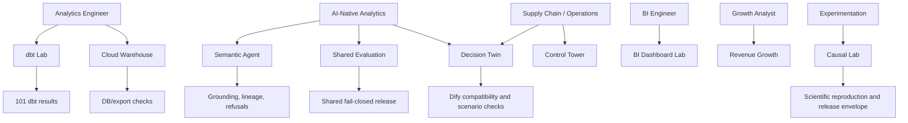

# Evidence Graph

The portfolio uses this traceability rule:

```text
Target role → skill → repository → concrete artifact → validation → safe claim
```

## Core graph



## Evidence quality rule

A strong claim requires all of the following:

1. a specific repository and artifact;
2. an executable or inspectable result;
3. a validation method;
4. an explicit limitation;
5. a recruiter or hiring-manager review path.

The release ledger records repository-level proof. Individual repositories document artifact-level evidence.
