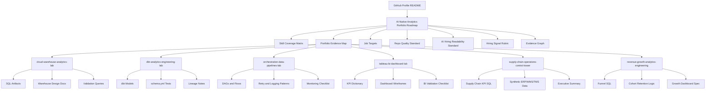

# Portfolio Information Architecture

## Purpose

This document defines how the analytics portfolio should be organized so that humans and AI systems can understand it as one connected evidence system.

The portfolio should not read as a random collection of repositories. It should read as a deliberate architecture:

```text
Profile README
  -> Central Roadmap Repository
  -> Skill Coverage Matrix
  -> Portfolio Evidence Map
  -> Role Mapping
  -> Individual Repositories
  -> Technical Artifacts
  -> Validation Evidence
```

The goal is to make the portfolio easy to scan, easy to verify, and easy to map to target roles.

---

## Core Architecture Principle

Every repository should have a clear place in the portfolio.

Every major skill claim should have:

```text
Skill
  -> repo that demonstrates it
  -> file or artifact that proves it
  -> validation or review method
  -> target role that values it
  -> claim level
```

This makes the portfolio readable by:

- recruiters
- hiring managers
- technical interviewers
- AI hiring assistants
- ATS-style summarization tools
- portfolio review agents

---

## Top-Level Navigation

The recommended portfolio navigation path is:

```text
GitHub Profile README
  -> AI-Native-Analytics-Portfolio-Roadmap/README.md
  -> SKILL_COVERAGE_MATRIX.md
  -> PORTFOLIO_EVIDENCE.md
  -> JOB_TARGETS.md
  -> REPO_QUALITY_STANDARD.md
  -> AI_HIRING_READABILITY_STANDARD.md
  -> HIRING_SIGNAL_RUBRIC.md
  -> EVIDENCE_GRAPH.md
  -> individual repos
```

This path lets a reviewer start broad and then inspect proof.

---

## Central Roadmap Repository

Repository:

```text
AI-Native-Analytics-Portfolio-Roadmap
```

This is the control plane for the portfolio.

It should explain:

- portfolio vision
- target role families
- repository map
- skill coverage
- evidence graph
- quality standards
- AI workflow methodology
- improvement backlog
- recruiter review path
- hiring manager review path

---

## Central Repository Files

The central repo should contain the following files.

| File | Purpose |
|---|---|
| `README.md` | Main portfolio entry point and navigation router |
| `SKILL_COVERAGE_MATRIX.md` | Maps skills to repos and artifacts |
| `PORTFOLIO_EVIDENCE.md` | Maps claims to inspectable evidence |
| `JOB_TARGETS.md` | Maps roles to strongest evidence |
| `REPO_QUALITY_STANDARD.md` | Defines quality bar for each repo |
| `AI_HIRING_READABILITY_STANDARD.md` | Defines machine/human readability rules |
| `HIRING_SIGNAL_RUBRIC.md` | Scores repos objectively |
| `PORTFOLIO_INFORMATION_ARCHITECTURE.md` | Defines this navigation architecture |
| `EVIDENCE_GRAPH.md` | Defines skill-to-artifact-to-role relationships |
| `AI_WORKFLOW_PLAYBOOK.md` | Documents AI-assisted workflow and human validation |
| `RECRUITER_GUIDE.md` | Shows a fast review path for recruiters |
| `BACKLOG.md` | Tracks next improvements |

---

## Approved Repository Set

The primary portfolio system currently focuses on these seven repositories:

```text
AI-Native-Analytics-Portfolio-Roadmap
cloud-warehouse-analytics-lab
dbt-analytics-engineering-lab
orchestration-data-pipelines-lab
tableau-bi-dashboard-lab
supply-chain-operations-control-tower
revenue-growth-analytics-engineering
```

Older repositories should not be modified or promoted unless explicitly included in a later phase.

---

## Repository Roles in the Portfolio

| Repository | Portfolio Role | Primary Hiring Signal |
|---|---|---|
| `AI-Native-Analytics-Portfolio-Roadmap` | Control plane | Strategy, evidence mapping, AI-native portfolio governance |
| `cloud-warehouse-analytics-lab` | Cloud warehouse evidence | SQL, Snowflake-style patterns, BigQuery-ready logic, warehouse design |
| `dbt-analytics-engineering-lab` | Analytics engineering evidence | dbt-style models, staging, marts, tests, lineage |
| `orchestration-data-pipelines-lab` | Pipeline orchestration evidence | Airflow/Prefect/Dagster/ADF concepts, retries, logging, dependencies |
| `tableau-bi-dashboard-lab` | BI presentation evidence | Dashboard design, KPI definitions, stakeholder-ready BI |
| `supply-chain-operations-control-tower` | Domain analytics evidence | OTIF, fill rate, lead time, inventory, freight, service level |
| `revenue-growth-analytics-engineering` | Growth analytics evidence | Funnel, cohort, retention, churn, segmentation, revenue metrics |

---

## Recommended Repo README Architecture

Every individual repo should follow this structure:

```markdown
# Project Title

## Executive Summary
## Business Problem
## Target Roles
## Skills Demonstrated
## Evidence Summary
## Repository Structure
## Architecture
## Data Model or Analytical Model
## Technical Artifacts
## Validation Strategy
## How to Review This Repo
## What This Demonstrates for Hiring Managers
## AI-Augmented Workflow
## Limitations
## Next Improvements
## Portfolio Context
```

This creates consistency across repos and helps automated readers parse the evidence.

---

## Evidence Summary Block

Every repo should include a block like this near the top of the README:

```markdown
## Evidence Summary

| Category | Evidence |
|---|---|
| Business problem | `<business problem>` |
| Main skills | `<skills>` |
| Technical artifacts | `<paths>` |
| Target roles | `<roles>` |
| Claim level | `<strong evidence / lab evidence / pattern evidence / planned evidence>` |
| Validation | `<checks or validation docs>` |
```

This summary helps a recruiter or AI system understand the repo quickly.

---

## Portfolio Context Block

Every individual repo should link back to the central roadmap:

```markdown
## Portfolio Context

This repository is part of the AI-Native Analytics Portfolio, a coverage-driven evidence system for modern Data & Analytics roles.

Start with the central roadmap:
[AI-Native-Analytics-Portfolio-Roadmap](https://github.com/net421/AI-Native-Analytics-Portfolio-Roadmap)
```

This prevents repos from appearing isolated.

---

## Cross-Linking Rules

### Central Roadmap Should Link To

- all seven approved repos
- skill coverage matrix
- evidence graph
- job targets
- quality standard
- AI hiring readability standard
- hiring signal rubric
- recruiter guide

### Each Repo Should Link To

- central roadmap
- portfolio evidence map
- related repos where useful
- validation documentation
- strongest technical artifacts

---

## Human Review Paths

### 60-Second Recruiter Path

```text
Profile README
  -> Central roadmap README
  -> Evidence summary table
  -> Strongest 2-3 repos
  -> Target roles
```

Recruiter should understand:

- what roles are targeted
- what skills are demonstrated
- which repos matter most
- what claims are safe

### 5-Minute Hiring Manager Path

```text
Central roadmap
  -> Skill coverage matrix
  -> One flagship repo README
  -> Technical artifact
  -> Validation strategy
  -> Limitations
```

Hiring manager should understand:

- technical depth
- business framing
- validation discipline
- realistic limitations
- next improvement path

### 20-Minute Technical Reviewer Path

```text
Central roadmap
  -> Evidence graph
  -> Repo-specific README
  -> SQL/dbt/Python files
  -> Validation checks
  -> CI or reproducibility notes
```

Technical reviewer should understand:

- model grain
- transformations
- assumptions
- quality gates
- architecture decisions

---

## AI Hiring Reader Path

AI systems often summarize what is easy to extract.

Therefore, use consistent structures:

```text
Role -> Skill -> Repository -> Artifact -> Validation -> Claim level
```

Avoid burying evidence in long paragraphs. Prefer tables and explicit links.

Recommended central tables:

1. Skill coverage table
2. Role-to-repo table
3. Repo-to-artifact table
4. Validation table
5. Claim boundary table
6. Backlog priority table

---

## Information Architecture Diagram



---

## Naming Standards

Use descriptive file names.

Good:

```text
analytics_mart_patterns.sql
supply_chain_kpi_dictionary.md
cohort_retention_analysis.sql
dashboard_wireframe_executive.md
validation_plan.md
sample_validation_output.md
recruiter_review_guide.md
```

Avoid:

```text
demo.sql
test.py
new.md
notes2.md
analysis_final_final.sql
random.md
```

Names should help both humans and AI systems infer the file purpose.

---

## Folder Structure Recommendations

### SQL-heavy repos

```text
sql/
  marts/
  validation/
  platform_examples/
docs/
  architecture.md
  data_model.md
  validation_plan.md
  recruiter_review_guide.md
sample_data/
outputs/
```

### dbt repo

```text
models/
  staging/
  intermediate/
  marts/
tests/
seeds/
macros/
docs/
  lineage.md
  model_grain.md
  validation_plan.md
```

### BI repo

```text
dashboards/
  wireframes/
  calculated_fields/
kpis/
docs/
  stakeholder_questions.md
  dashboard_validation_checklist.md
  semantic_layer_notes.md
```

### Pipeline/orchestration repo

```text
airflow/
prefect/
dagster/
adf/
docs/
  dependency_graph.md
  retry_strategy.md
  failure_handling.md
  monitoring_checklist.md
validation/
```

---

## Portfolio Promotion Strategy

Not every repo should be promoted equally.

Suggested promotion order:

1. `dbt-analytics-engineering-lab`
2. `cloud-warehouse-analytics-lab`
3. `supply-chain-operations-control-tower`
4. `revenue-growth-analytics-engineering`
5. `tableau-bi-dashboard-lab`
6. `orchestration-data-pipelines-lab`
7. `AI-Native-Analytics-Portfolio-Roadmap`

The roadmap is the control plane, but the first four repos should carry most of the job-market evidence.

---

## Maintenance Workflow

For every improvement cycle:

1. Select one repo or one review angle.
2. Identify weakest high-impact evidence gap.
3. Implement or request exactly one focused improvement.
4. Update evidence map if needed.
5. Update skill coverage if needed.
6. Add validation criteria.
7. Add safe claim level.
8. Commit with clear message.
9. Add next improvement to backlog.

---

## Final Architecture Goal

The final portfolio should communicate:

> This GitHub profile is organized as a deliberate, evidence-driven analytics portfolio. It maps target roles to skills, skills to repositories, repositories to artifacts, and artifacts to validation criteria.

The reviewer should never have to guess what a repo is meant to prove.
