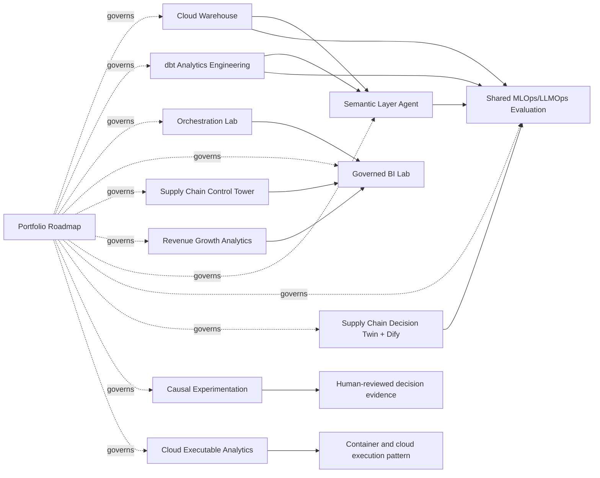

# AI-Native Analytics Portfolio Roadmap

This repository is the control plane for a 12-repository active analytics portfolio and a separately governed set of 7 frozen historical/scientific repositories.

The portfolio is designed as inspectable evidence rather than a list of technology claims. Every active repository has a defined scope, a validated release, honest claim boundaries and a review path.

## Portfolio at a glance

| Layer | Repositories | Purpose |
|---|---:|---|
| Control plane | 1 | Architecture, evidence ledger, release references and recruiter navigation |
| Foundational analytics | 6 | Warehouse, dbt, orchestration, BI, supply-chain and revenue systems |
| AI-native analytics | 5 | Semantic agent, shared evaluation, decision twin, causal experimentation and executable cloud pattern |
| Historical/scientific evidence | 7 | Frozen references outside the implementation backlog |

## Active architecture



Only solid arrows into the Semantic Agent and shared evaluator represent strict, commit-pinned integration contracts. Other relationships show portfolio-level complementarity, not a claim that all repositories run as one deployed platform.

## Active repositories

| Repository | Layer | Portfolio proof |
|---|---|---|
| [`supply-chain-operations-control-tower`](https://github.com/net421/supply-chain-operations-control-tower) | Foundational | Governed supply-chain KPIs, exceptions and cost/service evidence |
| [`cloud-warehouse-analytics-lab`](https://github.com/net421/cloud-warehouse-analytics-lab) | Foundational | Executable warehouse and cross-platform SQL patterns |
| [`dbt-analytics-engineering-lab`](https://github.com/net421/dbt-analytics-engineering-lab) | Foundational | Layered dbt models, tests, snapshot, exposures and evidence |
| [`orchestration-data-pipelines-lab`](https://github.com/net421/orchestration-data-pipelines-lab) | Foundational | Validation-first pipelines, failure recovery and orchestration mappings |
| [`tableau-bi-dashboard-lab`](https://github.com/net421/tableau-bi-dashboard-lab) | Foundational | Governed BI metrics and cross-platform dashboard specifications |
| [`revenue-growth-analytics-engineering`](https://github.com/net421/revenue-growth-analytics-engineering) | Foundational | Funnel, cohort, subscription and acquisition analytics |
| [`semantic-layer-ai-agent-lab`](https://github.com/net421/semantic-layer-ai-agent-lab) | AI-native | Safe semantic planning, SQL, lineage, grounding and refusals |
| [`mlops-llmops-evaluation-lab`](https://github.com/net421/mlops-llmops-evaluation-lab) | AI-native | Shared fail-closed evaluation for models and governed agents |
| [`supply-chain-decision-twin-agent`](https://github.com/net421/supply-chain-decision-twin-agent) | AI-native | Preserved Dify integration plus quantitative scenario decisions |
| [`causal-experimentation-lab`](https://github.com/net421/causal-experimentation-lab) | AI-native | Randomized experiment analysis and human-review release envelope |
| [`cloud-executable-analytics-lab`](https://github.com/net421/cloud-executable-analytics-lab) | AI-native | Reproducible container execution and cloud target pattern |

Exact release commits and validation summaries are in [`PORTFOLIO_RELEASE_LEDGER.json`](PORTFOLIO_RELEASE_LEDGER.json).

## Frozen historical/scientific repositories

**Los siete repositorios históricos aportan evidencia al portafolio, pero permanecen fuera del backlog de implementación, corrección, estandarización y publicación.**

They may be linked as historical or scientific evidence, but must not receive portfolio-standardization code, README, dependency, test, workflow, release, branch, commit or PR changes. See [`FROZEN_HISTORICAL_REPOSITORIES.md`](FROZEN_HISTORICAL_REPOSITORIES.md).

## Validation

```bash
make verify
```

The validator enforces the 12/7 architecture, release SHA format, dependency integrity, claim boundaries and the immutable status of the frozen repositories.

## Review paths

- [`RECRUITER_GUIDE.md`](RECRUITER_GUIDE.md): two-minute and role-specific review paths.
- [`INTEGRATION_ARCHITECTURE.md`](INTEGRATION_ARCHITECTURE.md): strict versus conceptual integrations.
- [`PORTFOLIO_EVIDENCE.md`](PORTFOLIO_EVIDENCE.md): evidence and validation index.
- [`SKILL_COVERAGE_MATRIX.md`](SKILL_COVERAGE_MATRIX.md): role-relevant skills and claim levels.
- [`BACKLOG.md`](BACKLOG.md): remaining presentation and external-platform work only.

## Claim boundary

The active repositories primarily use deterministic synthetic/local systems. They demonstrate engineering, analytics, evaluation and governance patterns. They do not by themselves prove production deployment, enterprise scale, real-world business impact or autonomous operational authority.
