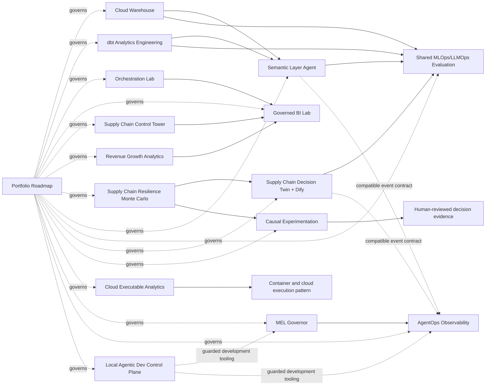

# AI-Native Analytics Portfolio Roadmap

This repository is the control plane for a 16-repository active analytics and agentic-systems portfolio, plus a separately governed set of 7 frozen historical/scientific repositories.

The portfolio is designed as inspectable evidence rather than a list of technology claims. Every active repository has a defined scope, a validated release, honest claim boundaries and a review path.

## Portfolio at a glance

| Layer | Repositories | Purpose |
|---|---:|---|
| Control plane | 1 | Architecture, evidence ledger, release references and recruiter navigation |
| Foundational analytics | 7 | Warehouse, dbt, orchestration, BI, supply-chain, revenue and Monte Carlo resilience systems |
| AI-native and agentic systems | 8 | Semantic agent, evaluation, decision twin, causal analysis, executable cloud pattern, multi-agent research, AgentOps and guarded development control |
| Historical/scientific evidence | 7 | Frozen references outside the implementation backlog |

## Active architecture



Only solid arrows into the Semantic Agent and shared evaluator represent strict, commit-pinned integration contracts. The Monte Carlo, AgentOps and development-tooling arrows are documented portfolio relationships or compatible contracts, not claims that all repositories run as one deployed platform.

## Active repositories

### Foundational analytics

| Repository | Portfolio proof |
|---|---|
| [`supply-chain-operations-control-tower`](https://github.com/net421/supply-chain-operations-control-tower) | Governed supply-chain KPIs, exceptions and cost/service evidence |
| [`cloud-warehouse-analytics-lab`](https://github.com/net421/cloud-warehouse-analytics-lab) | Executable warehouse and cross-platform SQL patterns |
| [`dbt-analytics-engineering-lab`](https://github.com/net421/dbt-analytics-engineering-lab) | Layered dbt models, tests, snapshot, exposures and evidence |
| [`orchestration-data-pipelines-lab`](https://github.com/net421/orchestration-data-pipelines-lab) | Validation-first pipelines, failure recovery and orchestration mappings |
| [`tableau-bi-dashboard-lab`](https://github.com/net421/tableau-bi-dashboard-lab) | Governed BI metrics and cross-platform dashboard specifications |
| [`revenue-growth-analytics-engineering`](https://github.com/net421/revenue-growth-analytics-engineering) | Funnel, cohort, subscription and acquisition analytics |
| [`supply-chain-resilience-monte-carlo-lab`](https://github.com/net421/supply-chain-resilience-monte-carlo-lab) | Seeded disruption simulation, tail risk, sensitivity and fail-closed reports |

### AI-native and agentic systems

| Repository | Portfolio proof |
|---|---|
| [`semantic-layer-ai-agent-lab`](https://github.com/net421/semantic-layer-ai-agent-lab) | Safe semantic planning, SQL, lineage, grounding and refusals |
| [`mlops-llmops-evaluation-lab`](https://github.com/net421/mlops-llmops-evaluation-lab) | Shared fail-closed evaluation for models and governed agents |
| [`supply-chain-decision-twin-agent`](https://github.com/net421/supply-chain-decision-twin-agent) | Preserved Dify integration plus quantitative scenario decisions |
| [`causal-experimentation-lab`](https://github.com/net421/causal-experimentation-lab) | Randomized experiment analysis and human-review release envelope |
| [`cloud-executable-analytics-lab`](https://github.com/net421/cloud-executable-analytics-lab) | Reproducible container execution and cloud target pattern |
| [`mel-governor`](https://github.com/net421/mel-governor) | Twenty-role political-economy multi-agent research and evidence governance |
| [`agentops-observability-lab`](https://github.com/net421/agentops-observability-lab) | SQLite event store, evaluation harness, metrics and read-only inspection |
| [`local-agentic-dev-control-plane`](https://github.com/net421/local-agentic-dev-control-plane) | Guarded planning, patch proposals, allowlisted validation and human review |

Exact release commits and validation summaries are in [`PORTFOLIO_RELEASE_LEDGER.json`](PORTFOLIO_RELEASE_LEDGER.json).

## New extension path

The four added repositories form an extension layer rather than replacing the existing analytics architecture:

```text
Historical scientific evidence
        ↓
Supply-chain resilience Monte Carlo
        ↓
Decision Twin / causal decision evidence

MEL Governor and other governed agents
        ↓
AgentOps observability and evaluation
        ↓
Human-reviewed evidence

Local Agentic Dev Control Plane
        ↓
Guarded repository work, validation and patch review
```

## Frozen historical/scientific repositories

**Los siete repositorios históricos aportan evidencia al portafolio, pero permanecen fuera del backlog de implementación, corrección, estandarización y publicación.**

They may be linked as historical or scientific evidence, but must not receive portfolio-standardization code, README, dependency, test, workflow, release, branch, commit or PR changes. See [`FROZEN_HISTORICAL_REPOSITORIES.md`](FROZEN_HISTORICAL_REPOSITORIES.md).

## Validation

```bash
make verify
```

The validator enforces the 16/7 architecture, release SHA format, dependency integrity, claim boundaries and the immutable status of the frozen repositories.

## Review paths

- [`RECRUITER_GUIDE.md`](RECRUITER_GUIDE.md): two-minute and role-specific review paths.
- [`INTEGRATION_ARCHITECTURE.md`](INTEGRATION_ARCHITECTURE.md): strict versus conceptual integrations.
- [`PORTFOLIO_EVIDENCE.md`](PORTFOLIO_EVIDENCE.md): evidence and validation index.
- [`SKILL_COVERAGE_MATRIX.md`](SKILL_COVERAGE_MATRIX.md): role-relevant skills and claim levels.
- [`BACKLOG.md`](BACKLOG.md): remaining presentation and external-platform work only.

## Rollback

The pre-expansion state is preserved at branch `backup/pre-16-repo-expansion-2026-07-12`.

## Claim boundary

The active repositories primarily use deterministic synthetic/local systems. They demonstrate engineering, analytics, evaluation and governance patterns. They do not by themselves prove production deployment, enterprise scale, real-world business impact or autonomous operational authority.
